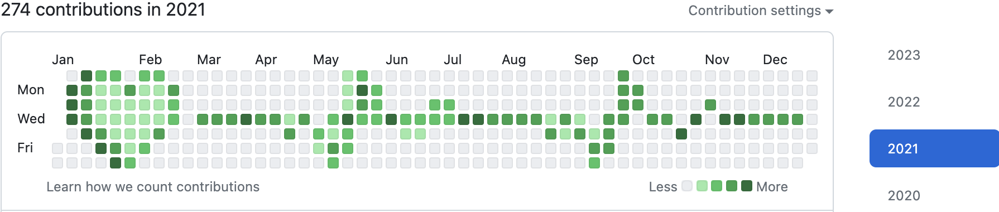
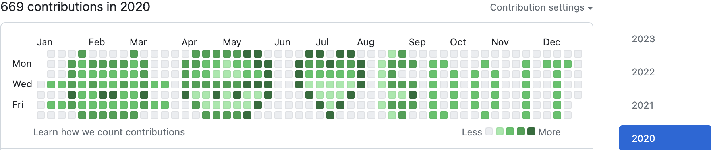
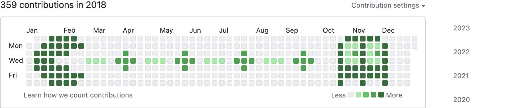

<!--   my-icons -->
<p align="center">
    <a href="https://github.com/TomZhang11/TomZhang11"></a>
    <a href="https://github.com/python/cpython"></a>
    <a href="https://github.com/TomZhang11/TomZhang11/stargazers"></a>
    
</p>

<!--   my-header-img -->

<a href="https://www.python.org/"></a>

<!--   my-ticker -->
[](https://git.io/typing-svg)

<!--   my-skils -->
| Property                                        | Data                                                                                                                                                                                                                                                                                                                                                                                                                                                                                                                                                                                                                                                                                                                                                                                                                                                              |
| ----------------------------------------------- | ----------------------------------------------------------------------------------------------------------------------------------------------------------------------------------------------------------------------------------------------------------------------------------------------------------------------------------------------------------------------------------------------------------------------------------------------------------------------------------------------------------------------------------------------------------------------------------------------------------------------------------------------------------------------------------------------------------------------------------------------------------------------------------------------------------------------------------------------------------------- |
| **Language / IDE**                              |                                                                                                                                                                                                                                                                                                                                                                                                                                                                                                                                                                                                                                                                                                                                                                |
| **Domain Knownledge**                           | [](https://github.com/search?q=user%3ATomZhang11&type=Repositories)  [](https://github.com/search?q=user%3ATomZhang11&type=Repositories)                                                                                                                                                                                                                                                                                                                                                                                                                                                                            |
| **CI / CD**                                     | [](https://github.com/TomZhang11/TomZhang11) [](https://github.com/TomZhang11/TomZhang11)                                                                                                                                                                                                                                                                                                                                                                                                                                                                                                                                                           |
| **Tools & Platform**                            |                                                                                                                                                                                                                                                                                                                                                                                                                                                                                                                                                             |


<!--   GitHub stats graph -->
### 📈 GitHub Activity Graph:
<!-- [![Tom's github activity graph]] -->

| .                                                                                                                   | .                                                                                                                             |
| ------------------------------------------------------------------------------------------------------------------- | ----------------------------------------------------------------------------------------------------------------------------- |
|  |  |

<!--   grid-snake -->


**📫 How to Reach me:**
<p align="left">
<a href="mailto:tomzhang.canada888@gmail.com" target="blank"></a>
<a href="https://www.linkedin.com/in/tom-zhang-764234287/" target="blank"></a>
</p>

<div align="center">
<summary>Trophy: Github Profile Trophy</summary>
</div>

<p align="center">
<a href="https://github.com/ryo-ma/github-profile-trophy"></a>
</p>






<!-- Canada - My Home-->
 ```geojson
{
 "type": "FeatureCollection",
 "features": [
   {
     "type": "Feature",
     "id": 1,
     "properties": {
       "ID": 0
     },
     "geometry": {
       "type": "Polygon",
       "coordinates": [
         [
             [-110.85,56.75],
             [-101.75,55.45]
         ]
       ]
     }
   }
 ]
}
```

#### Thanks for visiting :heart:
<p align="center">

counting of visitors to this page in this section started from Aug 7, 2023

## Star History
[](https://star-history.com/#TomZhang11/TomZhang11&Date)

### Profile Views
counting of visitors to this page in this section started from Auguest 7, 2023


</br>

[MIT](LICENSE)
</p>

---
  *If you liked my profile, you can Star ⭐ the repo and if you want to use this template you can Fork it and can use.*
---
Would you ike to meet me?

If you want to contribute to any of my repositories, feel free to submit PRs, issues and email me. Pick a slot if you'd like to meet me and chat about proposals and ideas - but make sure to describe the agenda


