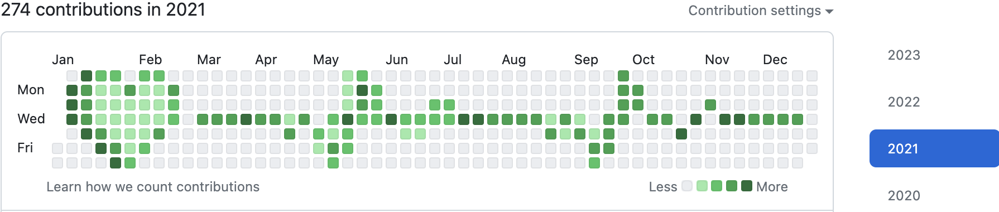
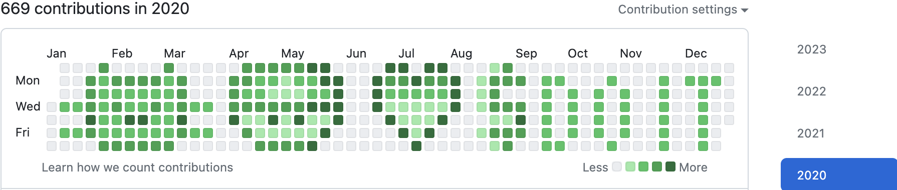
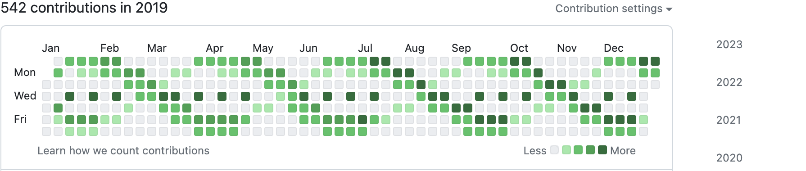
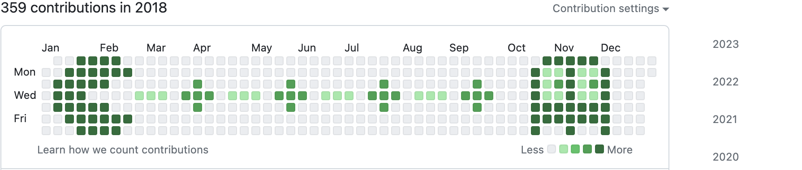

<!--   my-icons -->
<p align="center">
    <a href="https://github.com/TomZhang11/TomZhang11"></a>
    <a href="https://github.com/python/cpython"></a>
    <a href="https://github.com/TomZhang11/TomZhang11/stargazers"></a>
    
</p>

<!--   my-ticker -->
[](https://git.io/typing-svg)

<!--   GitHub stats graph -->
### 📈 GitHub Activity Graph
<!-- [![Tom's github activity graph]] -->


**📫 How to Reach me:**
<p align="left">
<a href="mailto:tomzhang.canada888@gmail.com" target="blank"></a>
<a href="https://www.linkedin.com/in/tom-zhang-764234287/" target="blank"></a>
<a href="https://x.com/zhang_tom12103"></img></a>
</p>






<!-- Canada - My Home-->
 ```geojson
{
 "type": "FeatureCollection",
 "features": [
   {
     "type": "Feature",
     "id": 1,
     "properties": {
       "ID": 0
     },
     "geometry": {
       "type": "Polygon",
       "coordinates": [
         [
             [-110.85,56.75],
             [-101.75,55.45]
         ]
       ]
     }
   }
 ]
}
```

#### Thanks for visiting :heart:

<p align="center">

counting of visitors to this page in this section started from Aug 7, 2023

### Profile Views

counting of visitors to this page in this section started from Auguest 7, 2023


</br>

[MIT](LICENSE)
</p>

---

*If you liked my profile, you can Star ⭐ the repo and if you want to use this template you can Fork it and can use.*
---

Would you like to meet me?

If you want to contribute to any of my repositories, feel free to submit PRs, issues and email me. Pick a slot if you'd like to meet me and chat about proposals and ideas - but make sure to describe the agenda
